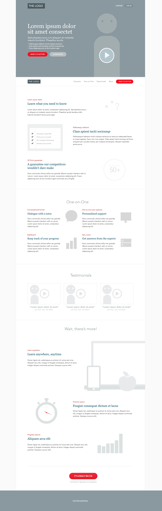

# CSS-framework-challenge

## About this project

This was a solo project carried out on the 21th of January 2021 as part of the BeCode Liège's Junior Web Developer programm. We were tasked to urn a wireframe into an interactive HTML page using a CSS framework of our choice. I chose Bootstrap as it is the most widely used framework.

### Learning objectives

- [ ] Understanding how a css framework is used

### The end result expected was : 

 

## [See my attempt here !](https://charlottemoureau.github.io/CSS-framework-challenge/)

This is me while completing the challenge:

